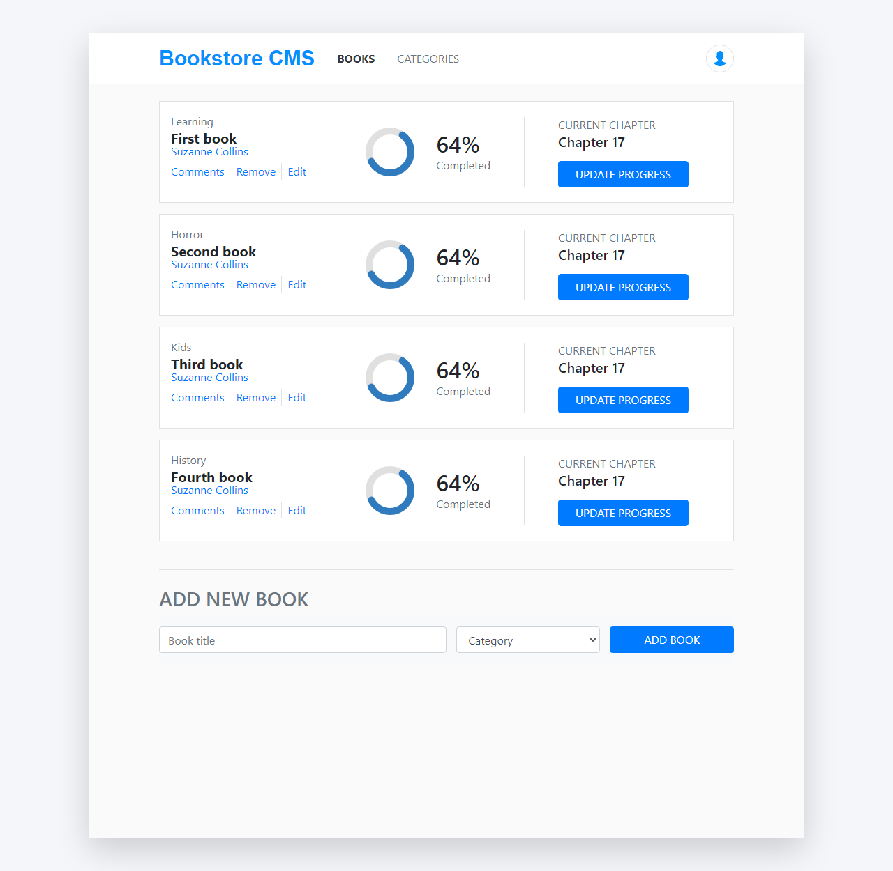

  

# Redux Bookstore.

> In this project, we were required to build a Bookstore by following a milestones guide.

## App functionality

- Users can see the books from the database and filter them by category.
- Users can add other books by filling up the title and selecting a category.

## Screenshot of the app.

## Live Demo

[Link](https://redux-bookstore199.herokuapp.com/)
[Rails_Backend](https://github.com/cristianCeamatu/bookstore-backend-rails)

## Built With

- React.js
- create-react-app
- Redux

## Prerequisities

To get this project up and running locally, you must have [node](https://nodejs.org/en/) and [yarn](https://yarnpkg.com/) installed locally.

## Getting Started

**To get this project set up on your local machine, follow these simple steps:**

**Step 1** 
Navigate through the local folder where you want to clone the repository and run 
`git@github.com:ebeagusamuel/Bookstore-Redux-.git`. It will clone the repo to your local folder. 
or with https 
`https://github.com/ebeagusamuel/Bookstore-Redux-/`. 
**Step 2** 
Run `cd Bookstore-Redux-` 
**Step 3** 
Run `yarn install` or `npm install` to install the npm packages from the `package.json` file. 
**Step 4** 
Run `yarn start` or `npm start` to start the webpack server, you can now navigate to `http://localhost:3000` to view the app. The server refreshes the app every time you make a change to a file used by it. 
**Step 5** 
Most important, enjoy the app! 

## Authors

👤 **Cristian Viorel Ceamatu**

- Email: [mail-to](cristian.ceamatu@gmail.com)
- Github: [cristianCeamatu](https://github.com/cristianCeamatu)
- Twitter: [@CristianCeamatu](https://twitter.com/CristianCeamatu)
- Linkedin: [ceamatu-cristian/](https://www.linkedin.com/in/ceamatu-cristian/)

👤 **Ebeagu Samuel**

- Email: [samuelebeagu@gmail.com](samuelebeagu@gmail.com)
- Github: [ebeagusamuel](https://github.com/ebeagusamuel)
- Twitter: [@ebeagu_samuel](https://twitter.com/ebeagu_samuel)
- Linkedin: [ebeagusamuel](https://www.linkedin.com/in/ebeagusamuel/)

## 🤝 Contributing

Our favourite contributions are those that help us improve the project, whether with a contribution, an issue, or a feature request!

## Show your support

If you've read this far....give us a ⭐️!

## 📝 License

This project is licensed by Microverse and the Odin Project

## Credits

User icon made by <a href="https://www.flaticon.com/authors/pixel-perfect" title="Pixel perfect">Pixel perfect</a> from <a href="https://www.flaticon.com/" title="Flaticon"> www.flaticon.com</a>
